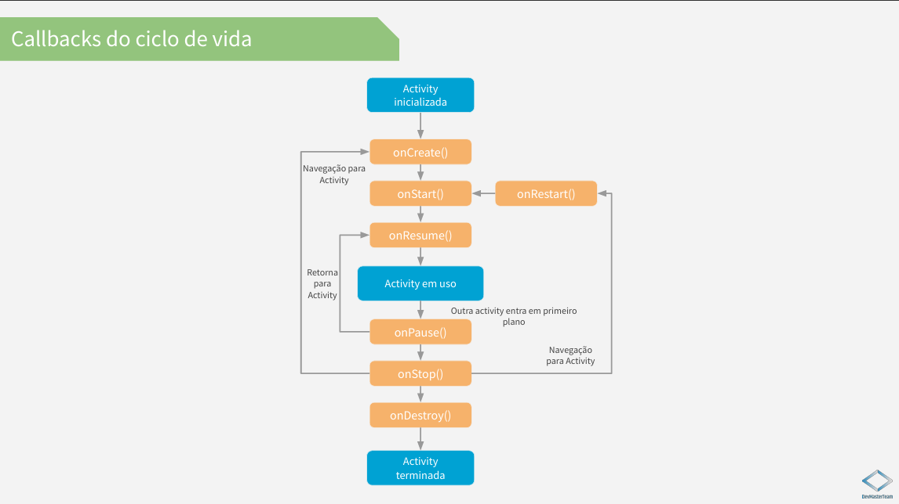

# app-books
Projeto do curso DevMaster Team

# Aplicativo de Livros (MVVM)

Este é um projeto de aplicativo Android desenvolvido como parte de um curso da Udemy, focado na implementação da arquitetura MVVM (Model-View-ViewModel) para criar um aplicativo de listagem e detalhamento de livros.

## Sobre o Projeto

O aplicativo permite aos usuários visualizar uma lista de livros, marcar livros como favoritos e ver detalhes específicos de cada livro em uma tela separada. O principal objetivo educacional deste projeto é demonstrar a aplicação prática do padrão de arquitetura MVVM em um contexto de desenvolvimento Android.

## Funcionalidades

*   **Listagem de Livros:** Exibe uma lista de livros obtida de uma fonte de dados.
*   **Detalhes do Livro:** Ao selecionar um livro da lista, o usuário é direcionado para uma tela de detalhes que exibe informações adicionais sobre o livro.
*   **Favoritos:** Permite ao usuário marcar e desmarcar livros como favoritos. (Esta funcionalidade pode ser implementada ou estar em desenvolvimento, dependendo do progresso do curso).

## Tecnologias Utilizadas

*   **Linguagem:** Kotlin
*   **Arquitetura:** MVVM (Model-View-ViewModel)
*   **Interface do Usuário:** XML com View Binding 

**Diagrama Simplificado do Ciclo de Vida da Activity:**

